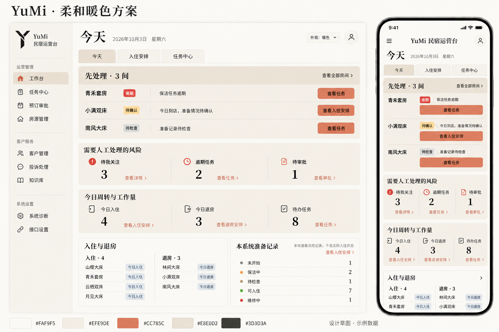

# 后台可切换暖色主题 Spec（DESIGN.md 方向）

日期：2026-10-03。源码基线：`094c707` / 应用 1.66.1。

状态：用户于 2026-10-03 在 Claude 审查核实后明确回复「开始」。按当前 Spec 与核实后的推荐取舍冻结功能与工程范围，已完成实现与本地验证；本轮不提交、推送或部署。

发布阶段补充：随后用户明确「不部署我怎么审查」，据此提交、推送并部署已完成主题为 1.67.0，供真实页面审查；前述不部署边界只适用于实施阶段。本轮不修改经营数据或客人回复路径。

## 1. 已确认需求与修订依据

- 用户：「准备给前端页面增加一个温馨民宿原木风格的设计」。
- 用户选择「新增可切换主题」：保留当前经典风格，增加一种原木主题。
- 用户：「浅橡木，但是主题白色不协调」：采用浅橡木，主体改为燕麦米色及浅亚麻色，取消大面积白底。
- 用户：「内容区层次太少效果不足」：增强内容区明暗、主次、分区和空间层次，不能只给所有区域涂同一层米色。
- 用户提供 getdesign 的 Claude 设计参考，并明确要求在项目根目录运行 `npx getdesign@latest add claude` 后读取 `DESIGN.md`。2026-10-03 已通过 `getdesign@0.6.25` 成功生成并完整读取根目录 `DESIGN.md`，未新增项目运行依赖或修改实现代码。
- 用户：「根据此方向优化」：上一轮据此绘制浅橡木与暖色参考融合的 v4 候选。
- 用户进一步明确：「根据 DESIGN.md 设计 ui 和配色」：本轮以该文档的奶油、珊瑚和暖黑原色体系为主依据，形成 v5 候选；不把上一轮自行推导的燕麦、焦糖和深陶土色继续作为当前配色依据。完整 Spec 与开始实施仍待确认。
- 用户：「黑色太突兀」：v6 将大面积黑底重点区改成暖奶油标题带与浅奶油列表，保留珊瑚主操作和深色文字；该明确反馈优先于参考的深色区交替规则。
- 用户：「就这样吧」：确认最新 v6 柔和暖色视觉，沿用图中的纯色纸感与「暖色」主题名称。此确认针对视觉，不自动代表完整功能与工程决策确认或开始编码。
- 已确认视觉参考见下图。图中的数据、房间、图标效果及任务说明均为示例，不新增对应业务能力。

当前以 v6 为已确认视觉目标，v3/v4/v5 保留为设计过程记录。本草案文件沿用原木任务的旧文件名，以保持审查链接连续；新增主题名称「暖色」，采用图中的纯色纸感，D1/D6 已随本次视觉确认。图中的图标、徽标色和示例动作文案不作为业务状态映射，落地仍使用真实模板及 `components/ui.html` 的语义。

v6 由内置 `image_gen` 在 v5 上定向替换黑色重点区，完整生成提示词已嵌入参考 PNG 的元数据；文档使用仓库内副本，不依赖个人生成目录。生成图只表达视觉方向，不证明每个像素采用了精确色值。

- 用户于 2026-10-03 在审查核实后回复「开始」：按本文及下述审查处理开始实施，保留经典默认、浏览器本地偏好和既有业务边界。

### 1.1 DESIGN.md 的采用方式

getdesign 对 Claude 官网营销页面的原始分析完整保存在 `docs/design/references/claude-design-analysis.md`；根目录 `DESIGN.md` 将改为 YuMi 双主题规范，头部机器令牌与本文一致。本轮将其作为 UI 与配色的主要设计依据，适配民宿后台的真实内容、中文和操作密度；新增主题仍与经典主题并存。文档本身不是运行资源或完整 Spec 确认。

- 采用 `Colors / Elevation & Depth` 的奶油页面、浅奶油卡片与深奶油重点标题带，层次由底色色阶、文字、间距和细分隔建立；普通卡片不增加重投影。依据用户「黑色太突兀」反馈，新增主题不再以大面积黑底强调内容。
- 色值直接取 DESIGN.md：`canvas #FAF9F5`、`surface-soft #F5F0E8`、`surface-card #EFE9DE`、`surface-cream-strong #E8E0D2`、`primary #CC785C`。已确认采用纯色纸感，不再添加浅橡木纹理资源，不自行另配一套棕色体系或新增第三种主题。
- 采用 `Typography / Shapes` 的编辑式标题与正文对比：中文页面/分区标题候选为本机宋体衬线，正文、导航、按钮和数字仍用当前中文系统无衬线。字体无需 CDN 或新增依赖；不引入其授权品牌字体、Logo、代码展示区或官网大留白。
- 参考的珊瑚背景配白字仅约 3.28:1。普通字号主按钮使用参考的珊瑚 `#CC785C` 配深墨 `#141413`，约 5.63:1；按下/悬停采用 `primary-active #A9583E` 配奶油字 `#FAF9F5`，约 4.80:1。文字链接采用暖灰正文 `#3D3D3A` 并保留下划线/清楚箭头；焦点采用较深的 `primary-active`。重点区改为浅底后，不能保留旧版反白文字或小字浅珊瑚链接。
- 参考的 `muted #6C6A64` 在卡片底 `#EFE9DE` 上约 4.48:1，因此卡片中的普通字号辅助信息采用已有 `body #3D3D3A`；`muted` 留给对比足够的奶油页面背景。细装饰分隔采用 hairline，必须识别的表单边界采用对比足够的既有文字/线条角色。
- 参考未完整覆盖表单校验、后台忙态和操作错误；这些状态继续按现有组件与 F4 验收，不删除悬停、焦点、错误或触控可访问性要求。实施前以本 Spec 的项目适配为准，不机械复制参考的全部数值和规则。

## 2. 当前代码证据

| 事实 | 路径与符号 | 对本次设计的约束 |
| --- | --- | --- |
| 全站浅色变量，蓝色主色、白面板、冷灰页面底 | `src/homestay_bot/static/app.css:: :root / .panel / .card / .admin-sidebar` | 复用当前角色变量，在新增主题下映射 DESIGN.md 的角色；经典主题的现有值和表现保持 |
| 后台与认证页共用同一 CSS，后台独有 defer 脚本 | `templates/layouts/admin.html::head`、`templates/layouts/auth.html::head`（均位于 `src/homestay_bot/`） | 两个公共布局均接入主题；避免为登录页加载所有后台操作逻辑 |
| 当前公共布局只有固定 theme-color，没有主题选择或偏好恢复 | `templates/layouts/admin.html::meta[theme-color] / topbar / sidebar-footer`；`static/admin.js::顶层初始化` | 本次新增最小的主题预加载脚本与原生选择控件，不另建设置页面 |
| 工作台先显示下一步，再显示风险、周转和入住退房 | `templates/admin/dashboard.html::workbench-first / metrics-risk / metrics-turnover / dashboard-grid` | 按已有业务分组增强视觉主次，保留原数据、排序和操作去向 |
| 抽屉可访问性与重复提交由现有脚本处理 | `static/admin.js::syncDrawerAccessibility / openDrawer / closeDrawer` 及批量选择、忙态逻辑 | 主题切换不重载页面、不改变抽屉状态、表单草稿和任务选择 |
| 认证表单独立于公共卡片页头 | `templates/layouts/auth.html::page-header / content`；`templates/auth/login.html::form` | 外观控件放在业务表单之外，不成为登录字段或提交按钮 |
| 后台响应禁止缓存与嵌套展示 | `middleware.py::AdminNoStoreMiddleware.__call__` | 不修改安全头、认证、CSRF 或浏览器认证存储；新脚本仅从本站静态目录加载 |
| 既有批量浏览器装配使用真实路由和临时 SQLite，但 set_content 后手动注入资源 | `tests/browser/test_admin_batch_workbench.py::admin_client / load_page` | 可复用真实业务装配；主题首帧、刷新和存储验证必须通过正常同源页面加载，不能仅靠手动 add_script_tag 证明 |

上表 `tests/` 路径相对于仓库根目录，其余未写完整前缀的实现路径相对于 `src/homestay_bot/`。本次所指前端是 Web 运营后台与认证页，不涉及 `clients/yumi` 原生客户端外壳。

## 3. 冻结的功能与视觉范围

### F1 两种主题与一致入口

- 选项为「经典」和一个新增主题「暖色」，名称已随 v6 视觉确认；首次访问默认经典，不是给每一种草图都增加一个主题。
- 桌面在顶部账号区域旁提供有标签的原生 select；手机将同一选择放在现有导航抽屉底部，保留窄屏顶部空间。登录及其他认证页在卡片页头提供选择。
- 复用 `components/ui.html` 的宏机制，拟新增 `theme_selector(control_id)`；每个实例的 label/id 唯一。桌面与抽屉控件只有符合断点的一处可见；切换后各实例值一致。
- 控件不进入业务 form；没有 JavaScript 时隐藏，原经典页面和业务操作仍可用。

### F2 偏好记忆与即时切换

- 用本浏览器的 `localStorage` 记住选择，键拟为 `yumi.admin.theme`，只接受 `classic`、`warm`；不写数据库或账号设置。上一轮 `wood` 仅为尚未实现的草案值，本次调整草案，不涉及已知运行配置迁移。
- 当前页立即切换；同一浏览器后续打开或刷新的后台、认证页恢复选择。其他已经打开的标签页不强制刷新；跨设备或清理浏览器后的偏好不在本次范围内。
- 新的 `static/theme.js` 在两个布局的样式表之前以本站外部脚本加载；先恢复根元素 `data-theme`，再在 DOM 就绪后绑定控件。它不设置后台抽屉的 js-enabled 状态，不复用或复制业务事件监听。
- 根元素缺少属性、偏好缺失或值非法时均使用经典。存储读取不可用时正常打开经典页；切换写入失败时仍在当前页生效，并用受控 aria-live 提示「本次已切换，浏览器无法记住此选择」，不假称已保存。
- theme-color 随主题更新，保持浏览器顶栏与页面底色协调；脚本加载失败时原页仍可使用。

### F3 DESIGN.md 的界面层次与配色

| 层级 | 视觉职责 | 候选色与处理 |
| --- | --- | --- |
| 页面底 | 温暖、明亮的阅读底 | 奶油 `#FAF9F5`，纯色承底 |
| 卡片与分组 | 清晰的浅色内容层 | `#EFE9DE` 卡片、`#F5F0E8` 柔和外壳、`#E8E0D2` 选中区域 |
| 重点内容区 | 先处理区具有最高业务优先级且柔和融入页面 | 标题带 `#E8E0D2`，列表底 `#F5F0E8`；标题/正文 `#3D3D3A`，列表辅助字 `#6C6A64`，不使用大块黑底 |
| 主动作 | 以稀疏强调色指向下一步 | 珊瑚 `#CC785C` 配深墨 `#141413`；交互变深为 `#A9583E` 配奶油字 |
| 正文与辅助信息 | 文字层级与阅读 | 主文字 `#141413`，正文 `#3D3D3A`；小字 `#6C6A64` 仅放在对比足够的背景 |
| 链接、焦点与分隔 | 可识别操作及低干扰边界 | 文字链接 `#3D3D3A` 配下划线/箭头，焦点 `#A9583E`；细装饰线 `#E6DFD8`；必要控件边界使用对比足够的更深角色 |

- 「先处理」沿用已有 `workbench-first`，通过深奶油标题带、浅奶油列表、清楚的标题和组间距维持最高优先级；行内使用暖灰深字与细分隔，仅暖色主题的行内动作入口定向采用珊瑚色；保留顶部「查看全部」及全局次级按钮层级，经典主题和 dashboard 模板不改，危险/待确认保留小范围语义提示。标题、原因及入口仍反映真实数据；缺少可靠入口时不新增按钮。
- 风险和今日周转沿用 `metrics-risk / metrics-turnover` 的两组语义，强化分组标题；不因草图新增指标、照片、图表或业务动作。
- 普通面板标题区、表头和行内容分层；风险与周转保持两组，指标靠数字大小和分组底色组织，不增加大面积彩色图标。主要分区间距比内部行距更明显，信息保持紧凑。
- 工作台下方保持真实 `dashboard-grid` 的「入住与退房」「本系统准备记录」两块，不把参考图的旧排班表或任务信息流作为新增结构；保留本地准备记录不等于实际入住状态的说明。
- 中文页面标题候选为桌面约 32px、手机约 28px，分区标题 20–22px；标题采用本机宋体衬线栈（Songti SC / STSong / SimSun / Noto Serif CJK SC / serif）与常规 400 字重，不要求合成粗体；保留 Windows 的 SimSun 回退。缺少中文衬线的设备接受系统字形差异，不承诺跨平台字形一致。行标题 16px、正文 14–16px、辅助信息约 13px，数字采用无衬线 28–32px。既有触控目标继续至少 44px，不能靠缩小文字和按钮塞进手机。
- 控件约 8px 圆角、面板约 12px；沿用原图标家族与中文系统正文栈。4px 间距节奏适配为行内 8–16px、主要分区约 24px，不照搬官网 96px 大留白。经典主题保留当前字体与尺寸。
- 已确认采用平整纸感，无运行时纹理资产；原木作为历史候选保留，不在实施中重新加入木纹或融合两套视觉。
- 以上十六进制为候选目标，落地前以真实计算样式、对比度和与视觉参考的比对确认，不把生成图片当作 CSS 或可访问性验证。

候选纯色组合已按 sRGB 相对亮度公式初查：重点标题约 8.32:1，重点区正文约 9.61:1，列表辅助字约 4.77:1，卡片文字链接约 9.02:1，焦点/重点标题底约 3.86:1，珊瑚按钮深墨字约 5.63:1，按下按钮奶油字约 4.80:1。这些只证明候选色组合，交互状态、透明叠层和最终浏览器计算样式仍需实施后验证。

### F4 功能状态与页面覆盖

- 后台公共外壳、表格、表单、列表卡、页签、空状态、确认区、弹层、提示和移动批量栏统一采用主题角色；硬编码的冷色需按实际语义处理，不能只覆盖 `:root` 后留下不协调的交互状态。
- 成功、危险、警告、信息仍按现有业务语义识别，保留文字和图标提示。`components/ui.html::readiness_status_badge / occupancy_badge` 的状态映射不改；不能把红色风险、绿色可入住都染成棕色。
- 悬停、选中、聚焦、禁用、提交中及错误提示在两主题下均可辨认。正常正文对比度至少 4.5:1，大字及必要控件边界/焦点至少 3:1。
- 保持已有桌面表格、手机卡片、表单字段、权限、确认文案、按钮资格和深链接。320px 时按真实可用宽度布局，继续保留滚动条回归。
- 切换主题不丢草稿、不清任务勾选、不重复绑定业务处理、不触发 POST、确认弹窗或离页提示。固定栏仍预留实际高度。

## 4. 冻结的风险与决策

| 决策 | 推荐 | 理由与边界 |
| --- | --- | --- |
| D1 最新视觉参考与名称（已确认） | 采用 v6 DESIGN.md 柔和暖色版及中文适配，新增主题名「暖色」 | 用户于 2026-10-03 回复「就这样吧」确认该版；对比度必要修正见 §1.1 |
| D2 默认与存储 | 默认经典，本浏览器保存，不新增账号设置 | 对当前用户的使用方式影响最小；无法跨设备同步 |
| D3 脚本边界 | 独立小型 theme.js，两个布局同步在 CSS 之前加载 | 登录页也能恢复，主题先于内容绘制；冷缓存多一个阻塞解析的小请求，接受这一取舍，避免内联与外部两条初始化路径。不引入外部字体或 CDN |
| D4 控件布局 | 桌面顶部、手机抽屉、认证页头 | 手机顶部仍保留品牌、导航和账号触控空间；各实例需同步，标签/id 不能重复 |
| D5 改造广度 | 共享视觉组件与主题覆盖，不改数据/业务流程 | 暖色主题必须照顾深层组件；发现需要业务或后端改动时返回 Spec，不顺手扩展 |
| D6 材质（已确认） | 采用 v6 纯色纸感，仅通过色块、文字和细线分层 | 用户确认当前无木纹的 v6 方案；此前浅橡木仅保留为需求历史，保持仅一个新增主题 |
| D7 设计规范 | 原文完整保留为参考，根目录为简短 YuMi 双主题规范 | 不只追加尾注；头部令牌直接声明经典与暖色、字体及可访问性修正 |
| D8 字体差异 | 常规字重、本机宋体回退、无字体网络请求 | 保留 SimSun；缺少该字体的设备可能显示系统无衬线，安卓真机结果单独记录，不用本机 Chromium 截图替代 |

验收必须分别看经典与新增主题：避免新主题漂亮但经典被公共规则改坏；奶油层次、重点区文字、红黄绿状态不能靠肉眼代替实际对比度。目前已有源码及本地同源浏览器实现证据，生产与真机表现仍未验收。

### 4.1 Claude 审查的核实处理

- T1：补暖色 warning `#92400E`、success `#166534`；危险红保持 `#B42318`。保留红黄绿业务映射，soft 底分别采用暖浅绿/暖浅黄/暖浅红。标题带的 eyebrow 用正文 `#3D3D3A`，全局辅助字取卡片上达标的正文色，先处理浅列表才使用 `#6C6A64`。原示例 urgent 实际用危险红，真实警告文字路径包括 cal__note--warn。
- T2：采用原文归档、根规范双主题方案；修正机器令牌，不能依赖尾注覆盖头部。
- T3：采用常规字重、保留 SimSun、记录平台回退；多数员工设备和仅苹果可用的判断未获证实。
- T4：保留已确认 v6 局部珊瑚行内动作，不改变经典或全局次级按钮，不修改业务模板。
- T5/T6：保留单一外部预加载脚本；两布局均有 theme-color，更新也容忍标签缺失。
- T7/T8：浏览器截图与灰度/色弱辨认纳入验收，色块之间比值不等于独立合规门槛。
- T9：检查根变量外 30 个 hex 和 2 个 RGB、四类阴影；按语义覆盖，保留并同步六个日历 color-mix 兼容回退，不机械替换危险色。
- 参考历史图与既有窄字体忽略保留；本轮无提交，后续提交范围另行确定。

## 5. 实施文件与验证目标

仅在完整 Spec 确认且用户明确「开始」后执行。

| 文件/符号 | 实施目标 | 验证目标 |
| --- | --- | --- |
| `DESIGN.md::双主题规范` 与 `docs/design/references/claude-design-analysis.md` | 完整保留参考原文；根规范与头部令牌记录经典/暖色适用范围、中文字体、奶油重点区及可访问性修正 | 与最终 Spec 和实际主题一致；不据参考恢复大面积黑底或删减已有状态与可访问性 |
| `src/homestay_bot/static/app.css::主题角色 / 公共组件 / 工作台分区` | 保留经典角色值，增加 warm 覆盖与少量必要的语义颜色变量；按现有组件表达 DESIGN.md 层次 | 两主题的状态、对比度、响应式、桌面与手机固定栏 |
| `src/homestay_bot/static/theme.js::applyTheme / 初始化与控件事件`（新） | 预加载偏好、纯视觉切换、可控存储失败、同步控件与 theme-color | 首次访问、刷新/新页、非法值、存储失败、脚本加载失败；无业务请求 |
| `src/homestay_bot/templates/layouts/admin.html::head / topbar / sidebar-footer` | 引入主题脚本与桌面/手机入口，版本缓存键沿用 app_version | 抽屉惯例与焦点保持，窄屏顶部不挤出 |
| `src/homestay_bot/templates/layouts/auth.html::head / page-header` | 认证页同一主题与入口，补 theme-color；控件在 form 之外 | 记忆一致，登录字段、令牌与认证流程不变 |
| `src/homestay_bot/templates/components/ui.html::theme_selector`（新宏） | 共用有标签的原生控件及受控反馈，不新增组件框架 | 多实例 id 唯一、断点可见性、键盘与读屏标签 |
| `tests/browser/test_admin_theme.py`（新）及直接相关的既有页面装配 | 复用真实路由/临时 SQLite，通过同源本地服务正常加载 HTML 与资源 | 真实主题行为、草稿/勾选、无提交、两主题与滚动条；不要用源码字符串或手工注入脚本代替 |

不改 `application.py`、路由、服务、仓储、数据库、真实外部消息或原生客户端外壳；若实施证据要求改变此边界，先修改并确认 Spec。

## 6. 最小验证矩阵

1. 经典默认、已保存新增主题、非法/缺失偏好、存储不可用；通过正常页面加载观察首个内容帧及恢复，不只断言中间数据属性。
2. 在后台和认证页切换，当前页立即生效、控件一致、刷新与同源新页保持；无 POST、页面跳转或新的认证/经营写入。
3. 保持编辑中草稿、批量勾选及抽屉焦点；复用现有选择、忙态、抽屉和未保存提醒用例验证相邻行为，不重写完整业务套件。
4. 两主题的代表页：工作台、任务、入住安排/日期、客户详情及认证页；320/360/390/1280px，以 `scrollWidth <= clientWidth` 检查滚动条槽位，勾选后固定栏与占位一致。
5. 真实前景/背景、焦点、原生控件、告警、成功、禁用与忙态的对比度及可辨认性；重点标题带日期、卡片与列表上的 warning/success 文字必须实测。灰度与色弱模拟下检查主操作、危险操作和逾期徽标。长房间名、空状态、选中项和错误状态不得破坏布局。手机截图比对层次；安卓真机未获得时明确保留验收缺口。
6. JavaScript 无法加载时，经典页面仍可操作；主题采用本站资源与本机字体，无额外材质/字体网络依赖；theme.js 不与 admin.js 双重绑定业务事件。

设计阶段已结束；实施只跑主题和直接相关浏览器回归、JS 语法及适用静态检查；共享装配/依赖若实际发生变化，按 AGENTS.md 的特殊门禁调整。没有客人回复路径变化，不跑真实模型或微信收发。提交、推送、版本升级和部署另需当前明确授权。

## 7. 确认顺序

- 已确认：新增可切换主题、增强内容层次、以 DESIGN.md 为主要依据的 v6 柔和暖色视觉，主题名称「暖色」、纯色纸感和降低大块黑色突兀感。D1/D6 已完成确认。
- 2026-10-03 用户在核实报告后明确「开始」：按 F1–F4、D2–D8 的本文范围实施并验证。
- 运行态表现与真机差异分别验收；提交、推送及部署仍需当前明确授权。

## 8. 实施与本地验证记录（2026-10-03）

- `theme.js::applyTheme / DOMContentLoaded` 已接入两套公共布局。真实同源页面验证首帧恢复、即时切换、刷新/新页记忆、非法值、读写存储失败、无脚本/资源失败；原生控件在业务表单之外。
- `app.css::warm 覆盖` 已实现奶油分层、珊瑚动作、常规字重系统衬线、深色语义文字及六组日历兼容回退。暖色指标说明与链接各占网格格位；经典对应规则保持原有视觉值。
- `tests/browser/test_admin_theme.py` 的 15 项用例通过。相关交互及日历最终回归 31 passed，前轮另有 26 项未受后续修改影响的相关通过证据；补充忙态/控件边界/焦点检查 3 passed，包含在主题用例内，不重复计数。两主题 × 5 类页面 × 4 个宽度共 40 组无根元素溢出。
- 真实计算样式检查普通文字至少 4.5:1、原生控件边界和焦点至少 3:1；人工复核合成数据的桌面/手机、灰度与绿色弱模拟截图。Ruff、JS 语法及差异检查通过；getdesign 原文已完整存档。
- 当前证据来自临时 SQLite 与本地 Chromium，未写经营数据、未调用真实外部服务。测试页的降级提示来自合成装配，不能用于判断生产健康；安卓/Windows 真机字体、原生 select 和生产登录页面仍未验收。未提交、推送、升级版本或部署。
